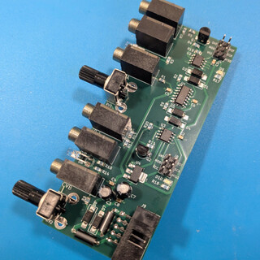

# Dual Gate Delay

A dual gate delay module in the Eurorack format. 

* Module size: 2HP (10mm)
* Power: 19mA (+12V); 9mA (-12V)

!!! repository "Project Source"

    The project files, including schematic and layout, are available on [github](https://github.com/xdylanm/gate-delay)

## Features

{align=right}

The module is implemented with an ATTiny13a microcontroller, with features including

* delays ranging from about 8ms to 2s
* gate pulse length is maintined
* sequences of up to 4 pulses can be delayed

A second, fully analog design is also described. This design is based on a current mirror and integration capacitor, and also maintains the gate pulse length. I have not implemented and tested this one.

## Documentation

[Design](theory.md)

[Assembly Guide](assembly.md)

[Schematic](assets/schematic.pdf)

## References / Inspiration

1.  [YuSynth Gate Delay](https://yusynth.net/Modular/EN/GATEDELAY/index.html)
2.  [Dopefer A-162 Dual Trigger Delay](https://doepfer.de/a162.htm)
3.  Spend some time reading old modwiggler forum threads\...