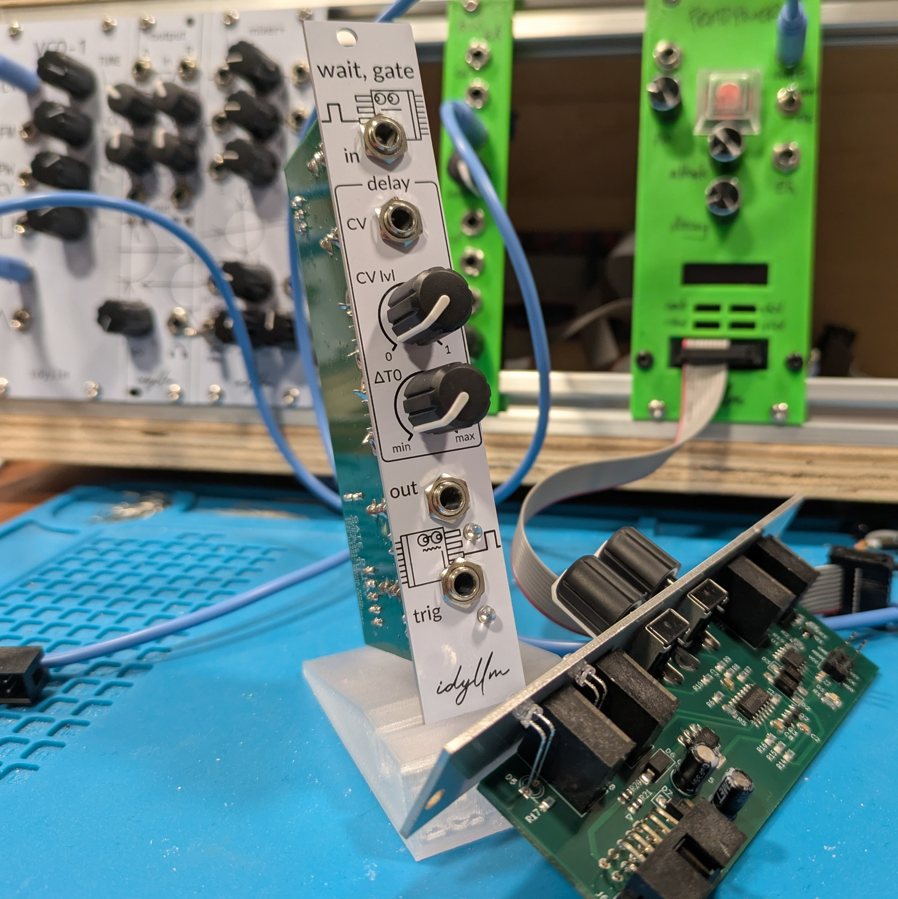

# Gate Delay

A gate delay module in the Eurorack format. 

* Module size: 2HP (10mm)
* Power: 19mA (+12V); 9mA (-12V)

!!! repository "Project Source"

    The project files, including schematic and layout, are available on [github](https://github.com/xdylanm/gate-delay)

## Features

{: width="360", align=right}

The module is implemented with an ATTiny13a microcontroller, with features including

* delays ranging from about 8ms to 2s (CV and offset potentiometer inputs)
* gate pulse length is maintained
* sequences of up to 4 pulses can be delayed
* pulse and 1ms trigger outputs at 5V

A second, fully analog design is also described. This design is based on a current mirror and integration capacitor, and also maintains the gate pulse length. I have not implemented or tested this one.

## Documentation

[Design](theory.md)

[Assembly Guide](assembly.md)

[Schematic](assets/schematic.pdf)

## Changelog

### 2.0.20251111

* Removed the second copy of the delay circuit
* Expanded delay control: 
    * CV with independent attenuation 
    * Separate manual delay offset
* Added a 1ms trigger output

### 1.0.20250917

* Original dual gate delay version (two copies with second gate input normaled to the first)
* CV input normaled with a DC bias to multiplex the attenuation/manual control of the delay
* Output delayed gate pulses with 5V amplitude

## References / Inspiration

1.  [YuSynth Gate Delay](https://yusynth.net/Modular/EN/GATEDELAY/index.html)
2.  [Dopefer A-162 Dual Trigger Delay](https://doepfer.de/a162.htm)
3.  Spend some time reading old modwiggler forum threads\...