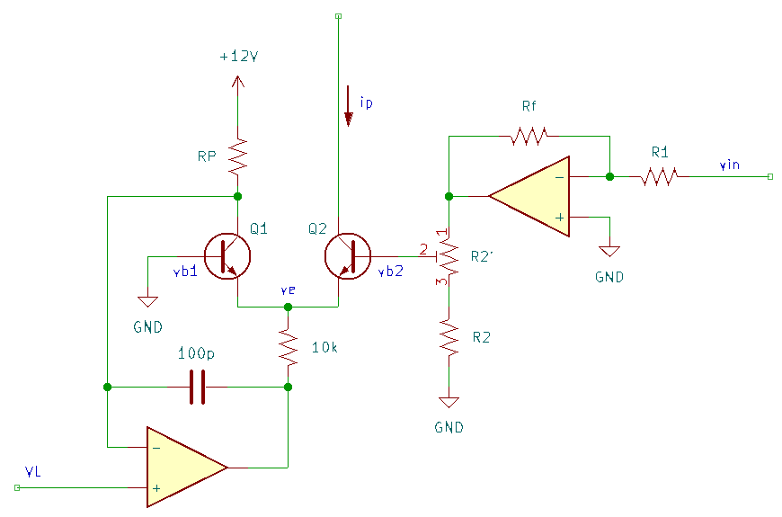
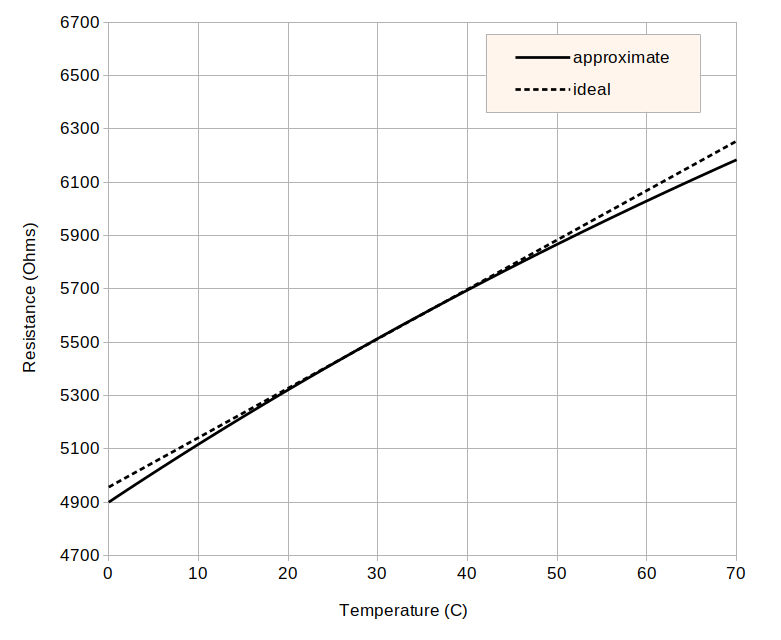
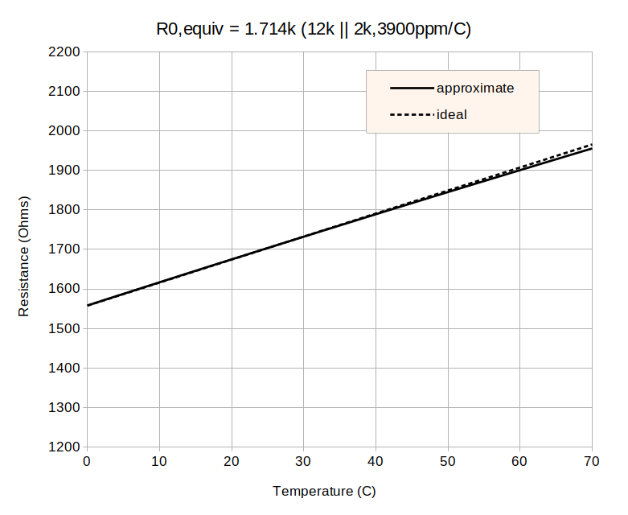

Analog Gate Delay Theory
========================

References
----------

1. Aaron Lanterman, "ECE4450 L18: Exponential Voltage-to-Current Conversion & Tempco Resistors", `youtube <https://www.youtube.com/watch?v=ZWJhApUmfEU>`_
2. Hal Chamberlain, *Musical Applications of Microprocessors*, 2nd Ed., Hayden Books, 1985
3. Paul Horowitz and Winfield Hill, *The Art of Electronics*, 3rd Ed., Cambridge University Press, 2015
4. Rene Schmitz, "A tutorial on exponential converters and temperature compensation", [`schmitzbits.de <https://schmitzbits.de/expo_tutorial/index.html>`_]
5. Paul Gray, et al., *Analysis and Design of Analog Integrated Circuits*, 4th Ed., Wiley, 2001

Delay Timing
------------

The delay timing is set the IV relationship for the capacitors:

.. math::
    I = C \frac{dV}{dt} \to t_d = \frac{C V_P}{i_p}

where :math:`t_d` is the delay time, :math:`C` is the capacitance of the timing capacitors, and :math:`V_P` is the positive threshold voltage of the Schmitt trigger inverter. 

**Constraints**

* :math:`V_P = 6V` 
* :math:`C = 100nF`
* let the current range from 0.5uA to 500uA 
* nominal control voltages range from 0 to 5V

With these assumptions, 

.. math::
    t_d = \left\{
    \begin{array}{ll}
    2\mathrm{ms}, & i_p = 300\mu\mathrm{A} \\
    1000\mathrm{ms}, & i_p = 0.6\mu\mathrm{A}
    \end{array}
    \right.

Exponential Voltage to Current Conversion
-----------------------------------------

To enable exponential control of the delay time, this design uses a differential pair to convert a control voltage to a current. Following the derviation in Lanterman's lecture (`youtube <https://www.youtube.com/watch?v=ZWJhApUmfEU>`_), the exponential voltage to current conversion is derived. Note that this design requires the opposite relationship betwen input control voltage (CV) and programming current: increasing delay (increasing CV) decreases the current to timing capacitors.

Using the relationship between :math:`v_{be}` and :math:`i_c` for a BJT (:math:`i_c = I_S \exp\left(v_{be}/V_T\right)`) and assuming that the transistors are matched, the collector current in Q2 (:math:`i_{c2}`) is related to the difference in the voltages at the bases when the emitters are at the same voltage :math:`v_e`. Grounding the base of *Q1* (not Q2) gives

.. math::
    i_{c2} = i_{c1}\exp\left(\frac{v_{b2}}{V_T}\right)

The voltage difference across :math:`R_P` sets the reference current :math:`I_{ref} = i_{c1}`. The voltage on the high side is set by the supply and on the low side by the op-amp, which replicates the reference voltage :math:`V_L` at the non-inverting input to the collector of Q1.

To establish the desired gain of an input stage, let :math:`v_{b2} = A v_{in}`. When the input voltage travels over the full range (0-5V), the programming current should *decrease* by a factor of 1000 (500uA to 0.5uA):

.. math::
    i_{p,max} &= I_{ref} \exp \left(\frac{A v_{in}}{V_T}\right) \\
    \frac{i_{p,max}}{1000} &= I_{ref} \exp \left(\frac{A (v_{in} +\Delta v_{in})}{V_T}\right) \\
    \to 1000 &= \exp \left(\frac{-A \Delta v_{in}}{V_T}\right) \\
    \to A &= -\frac{V_T \ln 1000}{5} = -1.3816 V_T

The value of :math:`I_{ref}` will be equal to :math:`i_{p,max}` when :math:`v_{in} = 0`. This will set the shortest delay time.

Using an op-amp in an inverting gain and a voltage divider to supply :math:`v_{b2}`

.. math::
    A &= -1.3816 V_T = -0.03578 \simeq -\frac{1}{28} = -\frac{R_f}{R_1} \frac{R_2 + \alpha R'_2}{R_2 + R'_2} \\
    \to \frac{1}{28} &= \frac{10\mathrm{k}\Omega}{270\mathrm{k}\Omega} \frac{1.93\mathrm{k}\Omega}{2\mathrm{k}\Omega}

where :math:`R'_2` is adjusted such that the voltage divider gives a gain of :math:`\frac{27}{28}`.

Temperature Compensation
------------------------

Continuing with Lanterman's derivation, replace :math:`R_f` with a tempco resistor, :math:`R_f = R_0[1+\alpha(T-T_0)]` where :math:`\alpha` is the thermal coefficient (note: use :math:`A'` in place of :math:`\tilde{\mathfrak{s}}`)

.. math::
    A = -\frac{R_f}{R_1}A' &= -\frac{R_0[1+\alpha(T-T_0)]}{R_1}A' = -\underbrace{1.3816}_{B} V_T \\
    \to \frac{R_0[1+\alpha(T-T_0)]}{R_1}A' &= \frac{kT}{q}B = \frac{k[T_0 + (T-T_0)]}{q}B \\
    &= \underbrace{\frac{kT_0}{q}}_{V_{T0}}B + \frac{kT_0}{q}\frac{(T- T_0)}{T_0}B \\
    \to \frac{R_0}{R_1}A' + \frac{\alpha R_0 (T-T_0)}{R_1}A' &= \underbrace{V_{T0}B}_{A_0} + \frac{V_{T0}}{T_0}B (T- T_0) \\
    \to A_0 &= \frac{R_0}{R_1}A' = V_{T0}B \\
    \to \frac{\alpha R_0 (T-T_0)}{R_1}A' &= A_0 \alpha(T-T_0) = V_{T0}B\frac{1}{T_0}B (T- T_0) \\
    \to \alpha &= \frac{1}{T_0} = 0.0034

Note that the temperature coefficient is positive. It's hard to find 3300ppm tempco resistors in 2025, so here's an alternative derivation where :math:`R_f = R_{f1}\parallel R_{f2}` where :math:`R_{f1}` is a tempco resistor and :math:`R_{f2}` is a regular resistor (assumed constant in temperature).

.. math::
    R_{f1}\parallel R_{f2} &= \frac{R_{f1}R_{f2}}{R_{f1} + R_{f2}} \\
    &= \frac{R_0[1+\alpha(T-T_0)]R_{f2}}{R_0[1+\alpha(T-T_0)] + R_{f2}} \\
    &= R_0\frac{1 + \alpha(T-T_0)}{\frac{R_0}{R_{f2}}[1+ \alpha(T-T_0)] + 1} \\
    &= R_0\frac{1 + \alpha(T-T_0)}{\left(1 + \frac{R_0}{R_{f2}}\right) + \underbrace{\frac{R_0}{R_{f2}}\alpha}_{\alpha'}(T-T_0)} \\
    
Assuming :math:`\alpha'(T-T_0) \ll 1` (prefer :math:`R_{f2} > R_0`)

.. math::
    \frac{1}{p + \alpha(T-T_0)} \approx \frac{1}{p} - \frac{\alpha(T-T_0)}{p^2}

such that

.. math::
    R_{f1}\parallel R_{f2} &\approx R_0\left[1 + \alpha(T-T_0)\right]\left(\frac{R_{f2}}{R_0 + R_{f2}}\right) \left[ 1 - \frac{R_{f2}\alpha'(T-T_0)}{R_0 + R_{f2}}\right] \\
    &= \left(\frac{R_0 R_{f2}}{R_0 + R_{f2}}\right)\left[1 + \alpha(T-T_0)\right] \left[ 1 - \underbrace{\frac{R_0}{R_0 + R_{f2}}}_{\gamma}\alpha(T-T_0)\right] \\
    &= \left(\frac{R_0 R_{f2}}{R_0 + R_{f2}}\right)\left[1 + \alpha(T-T_0)\right] \left[ 1 - \gamma\alpha(T-T_0)\right] \\
    &= \left(\frac{R_0 R_{f2}}{R_0 + R_{f2}}\right)\left[1 + (1-\gamma)\alpha(T-T_0) - \gamma\alpha^2(T-T_0)^2\right]\\
    
Given an available PTC resistor with resistance :math:`R_0` and temperature coefficient :math:`\alpha_0 > \alpha = 0.0034`, the parallel resistance :math:`R_{f2}` can be found as

.. math::
    \alpha &= (1-\gamma)\alpha_0 = \left(1 - \frac{R_0}{R_0 + R_{f2}}\right)\alpha_0 \\
    \to \frac{R_0}{R_0 + R_{f2}} &= 1 - \frac{\alpha}{\alpha_0} \\
    \to \frac{R_0\alpha_0}{\alpha_0 - \alpha} &= R_0 + R_{f2} \\
    \to R_{f2} &= R_0\left(\frac{\alpha_0}{\alpha_0 - \alpha} - 1\right) = R_0\left(\frac{\alpha}{\alpha_0 - \alpha}\right)

The following table collects a few currently manufactured parts available on Digikey (as of 2025):

.. list-table:: PTC Thermistors
    :header-rows: 1

    * - Mfg.
      - Part #
      - Package
      - :math:`R_0\ (\mathrm{k}\Omega)` 
      - :math:`\alpha (\mathrm{ppm/K})`
    * - KOA Speer
      - LT732ATTD202J3900
      - 0805 
      - 2
      - 3900
    * - KOA Speer
      - LT732ATTD102J3600
      - 0805 
      - 1
      - 3600
    * - Vishay Dale
      - TFPT1206L1002FM
      - 1206
      - 10
      - 4110
    * - Vishay Dale
      - TFPTL15L5001FL2B
      - THT 2.5mm
      - 5
      - 4110
    * - Texas Instruments
      - TMP6131LPGM
      - TO90-2
      - 10
      - 6400

As an example, the TMP6121LPGM (10k, 6400ppm/C TCR with 1% tolerance) in parallel with a 12k resistor approximates a 5.45k resistor with a 3400ppm/C temperature with a maximum error of 1.4% over the range from 0-70C.

A second example is the LT732ATTD202J3900 (2k, 3900ppm/C TCR with 10% tolerance) in parallel with a 12k resistor. This configuration approximates a 1.714k resistor with a 3400ppm/C TCR to within 0.5% over the range from 0-70C. 

The updated schematic is shown below.

.. image:: ./_static/images/lin_voltage_to_exp_current_tempco.png
    :width: 640px

With :math:`R_{f1}\parallel R_{f2} = 5.454\mathrm{k}\Omega` (10k PTC thermistor in parallel with a 12k resistor), :math:`R_1 = 150\mathrm{k}\Omega` gives an approximate gain in the inverting amplifier of :math:`0.03633` (:math:`1/27.5`) per the design requirement (the remaining fraction can be tuned in a :math:`100\Omega` trim pot in series with a :math:`2.2\mathrm{k}\Omega` resistor in the voltage divider).

Current Mirror
--------------

This derivation follows section A.4.1.1 (appendix 1.1 in chapter 4) of Gray's book (ref. 5).

The programming current is mirrored to both the capacitors (corresponding to the leading edge and trailing edge delay timing). The key design requirement is the match between these two copies of the current: errors in the ratio of the copy to the programming current are more tolerable. 

The base voltages (relative to ground) of all transistors in the current mirror are equivalent by construction:

.. math::
    v_{b} &= V_{CC} - i_{e}R_E - v_{be} \\
    &= V_{CC} - \frac{i_{c}}{\alpha_F} R_E - V_T \ln \frac{i_{c}}{I_S}

Taking the difference of these equations for Q2 and Q3 (note: in Gray, there is a beta helper as Q2, so the numbering is different)

.. math::
    \frac{i_{c2}}{\alpha_{F2}} R_{E2} - \frac{i_{c3}}{\alpha_{F3}} R_{E3} + V_T \ln \frac{i_{c2}}{I_{S2}} - V_T \ln \frac{i_{c3}}{I_{S3}} = 0

Defining *average* and *mismatch* parameters, e.g. :math:`i_c = 1/2(i_{c2}+i_{c3})` and :math:`\Delta i_c = i_{c3}-i_{c2}`, and using assumptions

* :math:`Delta i_c / 2i_c \ll 1`
* :math:`\ln (1+x) \simeq x` if :math:`x \ll 1`

the voltage equation yields the following relationship for the current error (see Gray Eq. 4.296):

.. math::
    \mathrm{let} A &= \frac{g_m R_E}{\alpha_F} \\
    \frac{\Delta i_c}{i_c} &= \left(\frac{1}{1 + A} \right)\frac{\Delta I_S}{I_S} + \frac{A}{1+A}\left(-\frac{\Delta R_E}{R_E} + \frac{\Delta \alpha_F}{\alpha_F}\right)

Recall that :math:`\alpha_F = \frac{\beta_F}{1 + \beta_F} \approx 1` and :math:`g_m = i_c/V_T` such that the term :math:`A` is the ratio of the (average) voltage drop across :math:`R_E` to :math:`V_T`. This leads to the following conclusions

1. If :math:`A \gg 1`, the effect of the mismatch between transistors Q2 and Q3 is reduced by :math:`\sim 1/A`. 
2. The negative sign in the second term indicates that an intentional difference between :math:`R_{E2}` and :math:`R_{E3}` can be used to cancel the error due to :math:`\alpha_F`.
3. :math:`R_E` increases the output impedance of the transistor, reducing the current error due to the dependence of :math:`i_c` on :math:`v_{ce}` (Early effect). This can reduce the error :math:`\epsilon \propto \Delta i_c / i_c` from :math:`\epsilon ~ \frac{\Delta v_{ce}}{V_A}` to :math:`\frac{\Delta v_{ce}}{V_A(1+A)}`.

Combined, emitter degeneration with a voltage drop of :math:`>10V_T` and an intentional difference can significantly reduce the current mismatch in the output branches of the current mirror. However, this is limited by the requirement to maintain the transistors in the forward active region: :math:`V_{cc} - V_{out,max} = v_{ce,sat.} + i_{e}R_E`. Given 

* :math:`V_{cc} = 11.4` V 
* :math:`V_{out,max} = 9.1` V (Zener voltage)
* :math:`v_{ce,sat.} = 0.3` V (BC557)
* :math:`i_{c,max} = 500\mu` A (design)

then :math:`R_E < 5.2\mathrm{k}\Omega` (choose :math:`R_E =4.7\mathrm{k}\Omega`). Note that :math:`V_{RE} ~ 0` when the current drops below :math:`10\mu\mathrm{A}`, so this approach has limited effectiveness for low currents (longer delay times). 

